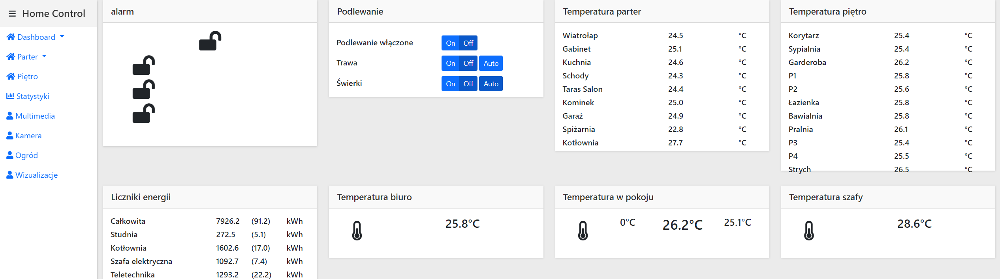

# hc-front
Front-end for Home Control project.

## Description
Home Control project was designed as a part of full, PLC based, home automation project.
I created a PLC control program for Siemens S7-1200 driver.

Communication between PLC and hc is done through database which is the place where current data state is stored and commands are exchanged.
Additionally there are couple of socket listeneres used for translate rough TCP packets to proper form.

### How to run it
1. You need hc-back project (will be uploaded soon) placed in the same location as hc-front folder
2. Configure your environment
    1. Install nvm
    2. Install nodejs with specific version `nvm install 13.14.0`
    3. Using `npm` install `yarn` `npm install --global yarn`
    4. Add missing css-loader `npm install css-loader -D`
    5. Run PowerShell with Admin right and execute `Set-ExecutionPolicy RemoteSigned`
    6. Execute `yarn install`
3. Start the project `yarn webpack`
